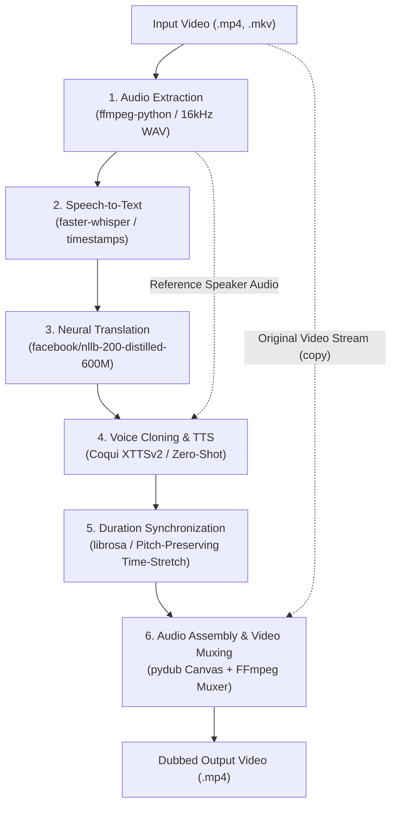

# Dubbot - 100% Local AI Video Dubbing Bot

An end-to-end, free, open-source, and **100% local** AI dubbing pipeline. **Zero cloud APIs**, zero subscription fees, and complete privacy.

Dubbot takes an input video in a source language, extracts the audio, transcribes with millisecond timestamps, translates to the target language, synthesizes new speech with zero-shot voice cloning matching the original speaker's timbre and emotion, dynamically aligns the duration using pitch-preserving time-stretching, and muxes the dubbed audio track back into the original video.

---

## Architecture Overview



---

## Features

- **100% Local & Free:** Runs completely on your own machine. No OpenAI, no ElevenLabs, no monthly subscriptions, and no rate limits.
- **Voice Cloning:** Leverages **Coqui XTTSv2** to clone the original speaker's vocal characteristics, pitch, and emotion into 17 target languages using only a sample slice from the input video.
- **Millisecond Timestamp Alignment:** Transcribes via **faster-whisper** (CTranslate2) and applies **pitch-preserving time-stretching** (`librosa.effects.time_stretch`) so translated speech fits into the original speaker's pause and speech windows.
- **Quality Preservation:** Video stream is copied (`vcodec="copy"`) directly without re-encoding to preserve 100% of the original video quality.
- **Hardware Acceleration:** Native NVIDIA CUDA (PyTorch + CTranslate2) acceleration with automatic fallback to CPU.

---

## Prerequisites

1. **Operating System:** Windows 10/11 or Linux.
2. **Python:** Python 3.10 (recommended for PyTorch and Coqui TTS compatibility).
3. **FFmpeg:** Installed and added to system `PATH`.
   - On Windows: `winget install Gyan.FFmpeg.Essentials`
   - On Linux: `sudo apt install ffmpeg`
4. **GPU (Recommended):** NVIDIA GPU with 6GB+ VRAM (tested on RTX 3060 12GB).

---

## Installation

### 1. Clone the repository
```bash
git clone https://github.com/JustSuffer/dubbot.git
cd dubbot
```

### 2. Create Python 3.10 environment
Using `uv` (recommended for speed and reproducibility):
```bash
uv venv --python 3.10 .venv
# Windows PowerShell
.venv\Scripts\activate
# Linux/macOS
source .venv/bin/activate
```

### 3. Install PyTorch with CUDA
```bash
# For CUDA 12.1:
uv pip install torch torchaudio --index-url https://download.pytorch.org/whl/cu121
```

### 4. Install Dependencies
```bash
uv pip install -r requirements.txt
```

---

## CLI Usage

Run `main.py` directly from the terminal:

```bash
python main.py --video "sample.mp4" --target_lang "tr"
```

### Command-Line Arguments

| Argument | Shorthand | Default | Description |
|---|---|---|---|
| `--video` | `-v` | *Required* | Path to the source video file |
| `--target_lang` | `-t` | *Required* | Target language code (`tr`, `es`, `fr`, `de`, `en`, `it`, `pt`, `ru`, `zh`, `ja`, etc.) |
| `--source_lang` | `-s` | `auto` | Source language code (`auto` for auto-detection) |
| `--output` | `-o` | None | Output video path (defaults to `<name>_dubbed_<lang>.mp4`) |
| `--speaker_wav` | | None | Optional custom reference audio for voice cloning |
| `--whisper_model` | | `base` | Whisper model size (`tiny`, `base`, `small`, `medium`, `large-v3`) |
| `--device` | | `auto` | Accelerator: `auto`, `cuda`, or `cpu` |
| `--keep_temp` | | `False` | Keep intermediate audio slices and work directory |
| `--verbose` | | `False` | Enable debug logs |

### Examples

**Dub an English YouTube video to Turkish:**
```bash
python main.py -v "interview.mp4" -t "tr"
```

**Dub a Spanish tutorial to German using high-accuracy Whisper model:**
```bash
python main.py -v "tutorial.mp4" -s "es" -t "de" --whisper_model "small"
```

---

## Python API Usage

```python
from dubbot import DubbingPipeline

# Initialize the modular pipeline
pipeline = DubbingPipeline(
    whisper_model="base",
    device="cuda",
)

# Run dubbing
result = pipeline.run(
    video_path="input.mp4",
    target_lang="tr",
    source_lang="en",
    output_video_path="output_dubbed_tr.mp4",
)

print(f"Dubbed video generated: {result['output_video']}")
```

---

## Project Structure

```
dubbot/
├── main.py                     # CLI entry point
├── requirements.txt            # Project dependencies
├── README.md                   # Documentation
├── src/
│   └── dubbot/
│       ├── __init__.py         # Package exports
│       ├── audio_extractor.py  # Step 1: 16kHz mono WAV extraction via ffmpeg-python
│       ├── transcriber.py      # Step 2: Speech-to-text with timestamps via faster-whisper
│       ├── translator.py       # Step 3: Neural translation via facebook/nllb-200
│       ├── synthesizer.py      # Step 4: Zero-shot voice cloning via Coqui XTTSv2
│       ├── aligner.py          # Step 5: Pitch-preserving time-stretching via librosa
│       ├── muxer.py            # Step 6: Audio canvas assembly & video muxing via ffmpeg
│       └── pipeline.py         # Full pipeline orchestrator
└── tests/
    ├── test_audio_extractor.py # Audio extraction unit tests
    ├── test_transcriber.py     # Transcriber unit tests
    ├── test_translator.py      # Translation unit tests
    ├── test_aligner.py         # Time-stretching unit tests
    ├── test_muxer.py           # Audio assembly & muxing tests
    ├── test_synthesizer.py     # XTTSv2 voice cloning tests
    └── test_full_pipeline.py   # Complete end-to-end integration test
```

---

## Supported Target Languages

The following 17 languages are natively supported with zero-shot voice cloning:

| Language | Code | Language | Code | Language | Code |
|---|---|---|---|---|---|
| English | `en` | Turkish | `tr` | Spanish | `es` |
| French | `fr` | German | `de` | Italian | `it` |
| Portuguese | `pt` | Polish | `pl` | Russian | `ru` |
| Dutch | `nl` | Czech | `cs` | Arabic | `ar` |
| Chinese | `zh` | Japanese | `ja` | Korean | `ko` |
| Hungarian | `hu` | Hindi | `hi` | | |

---

## License

This project is licensed under the MIT License. Models used (Whisper, NLLB, Coqui XTTSv2) are subject to their respective open-source licenses.
